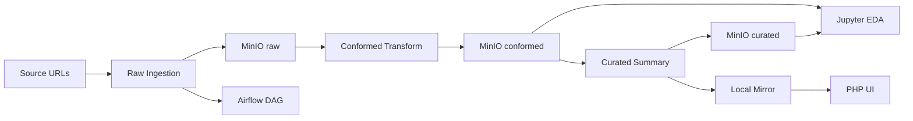

<div class="centered-image" style="max-width:900px; margin:0 auto;">
  <a href="/overlay_asx_historic_csv/overlay_asx_historic_csv.png">
    
  </a>
</div>


The Open Source Data Lake is designed to be practical, inspectable, and extensible in real use — not just in principle.

The first overlay demonstrated this using a Kaggle dataset. The next question was more demanding:

> Can the same packaging and runtime model support a fundamentally different source class, without redesigning the platform?

This article answers that question using historic ASX tabular data published over HTTP.

The objective was not to build an ASX-specific application. The objective was to validate the platform under real conditions.

- The platform needed to accept a new data source without modifying core services.  
- The pipeline needed to execute end-to-end through MinIO-backed medallion layers.  
- Execution needed to be observable and controllable through Airflow.  
- Outputs needed to be inspectable and validated through Jupyter.  
- Results needed to be exposed through a lightweight application layer.  
- The entire capability needed to install via a clean, reproducible overlay package.  

This is a continuation of the same idea: extending the platform by **adding capability, not modifying it**.

&nbsp;

## Why this needed to work without redesign

The work was deliberately constrained to ensure that the platform itself was being tested rather than extended through ad hoc changes.

- The implementation was developed on branch `feature/overlay-asx_historic_csv`.  
- The starting point was a proven overlay template and the prior Kaggle ingestion overlay.  
- The core rule was that no second architecture would be introduced.  

These constraints enforce discipline.

- Every new ingestion must reuse the existing pattern.  
- Every improvement must justify promotion into the base platform.  
- Every overlay must behave as a first-class workload without modifying the core system.  

Without this discipline, a platform quickly becomes a collection of one-off implementations.

&nbsp;

## The overlay model

The architecture remained unchanged.

```
Community Edition (base runtime)
├── dags/
├── scripts/
├── notebooks/
├── config/
└── php/

Overlay package (installable)
├── config/
├── scripts/
├── dags/
├── notebooks/
├── php/
└── overlay_asx_historic_csv/
    ├── compose override
    ├── start/stop wrappers
    ├── Dockerfiles
    └── docs
```

This structure separates execution from delivery.

- The root runtime defines where services operate.  
- The overlay package defines how new capability is introduced.  

This separation enables a critical property.

> A working data pipeline can be installed by unzipping an archive into a clean environment, with no manual file placement after unzip.

&nbsp;

## What the overlay does

The overlay implements a complete medallion pipeline.



&nbsp;

The orchestration layer can be observed directly in Airflow:

<div class="centered-image" style="max-width:900px; margin:0 auto;">
  
</div>


* Configuration defines source URLs and storage targets.
* Source files are downloaded and written to the `raw` bucket.
* Data is standardised and written as Parquet in the `conformed` bucket.
* Summary artefacts are generated and stored in the `curated` bucket.
* Curated outputs are mirrored locally for PHP rendering.
* The pipeline is orchestrated in Airflow, validated in Jupyter, and exposed through a PHP interface.

The initial assumption was that all sources would be CSV. This assumption did not survive contact with real data.

 

## How the pipeline is structured

The overlay is composed of a small number of clearly defined components.

* The configuration layer defines jobs, source locations, and storage targets.
* The ingestion script downloads and validates source files.
* The transformation stage normalises data and writes Parquet outputs.
* The curated stage generates summary artefacts.
* The Airflow DAG orchestrates execution.
* The notebook validates and explores the data.
* The PHP layer presents curated outputs.

A strict design discipline was maintained throughout.

* ASX-specific logic remained isolated within the overlay.
* Only reusable capabilities were promoted into the base platform.

 

## The first real dataset broke the contract

The first execution attempt did not succeed. It revealed a mismatch between expectation and reality.

* The pipeline expected CSV input.
* The actual dataset was delivered as an Excel workbook (`.xlsx`).
* The ingestion stage rejected the file, as designed.

This behaviour is important.

> The system did not fail. It enforced its contract.

The response was to widen the contract rather than redesign the system.

* Support was added for `.xlsx` files.
* Support was extended to legacy `.xls` formats.
* Docker images were updated to include the required dependencies.

The architecture remained unchanged. The pipeline evolved within its existing boundaries.

 

## What happened across real market data

The overlay was tested across multiple years of ASX market index files.

* The ingestion stage completed successfully across all files.
* The transformation stage produced usable outputs in all cases.
* The curated stage generated consistent summary artefacts.

At the same time, schema consistency varied.

* Newer datasets aligned closely with expected structures.
* Older datasets used different column names and formats.
* Some datasets required fallback to string-heavy representations.

This distinction is critical.

> Operational consistency does not imply semantic consistency.

The platform handled variability in format and structure. The remaining challenge is alignment of meaning.

<div style="max-width:900px; margin:0 auto;">
  
</div>

## The missing-date investigation

The notebook layer exposed a consistent pattern in the 2025 dataset.

* A large number of rows contained no `business_date`.
* Every row missing a date also lacked a `last_price`.
* No rows were observed where a price existed without a corresponding date.

<div style="max-width:900px; margin:0 auto;">
  
</div>

This strongly suggests that the issue originates from the source data rather than the transformation process.

Further inspection showed clustering in specific instrument types, particularly warrants.

This demonstrates that the notebook is not decorative. It is a critical part of validating the behaviour of the pipeline.

 

## Platform versus overlay responsibilities

A clear boundary was maintained between the base platform and the overlay.

* Generic improvements, such as shared mounts and Excel support, were promoted to the base platform.
* ASX-specific ingestion logic, configuration, and presentation remained within the overlay.

This enforces a simple rule.

> The platform evolves only when reuse is proven.

 

## Installing this should be boring

Packaging was treated as a first-class requirement.

* The overlay is distributed as a zip archive.
* The archive is unzipped into a clean Community Edition checkout.
* A job configuration file is created from the packaged example and edited for the desired source URLs.
* The platform is started using the overlay wrapper command.

No manual placement of overlay files is required after unzip.

Validation confirmed that a clean install produces a runnable overlay-aware system.

* Airflow exposes the overlay DAG.
* MinIO is ready to receive raw, conformed, and curated objects.
* The notebook can validate the configured dataset.
* The PHP page can render curated summaries after the pipeline has been run.

This is deliberate.

> Installation should be routine, not an engineering exercise.

This overlay was designed, implemented, validated, and packaged within a single working day — from initial architecture through to a reproducible installation. 

## Run this yourself

<div style="max-width:900px; margin:0 auto;">
  
</div>

The overlay is designed to be executed in a clean environment.

* Follow the Community Edition setup guide:
  [https://czarneckii.com/local/](https://czarneckii.com/local/)

* Download the overlay package from GitHub:
  [overlay_asx_historic_csv_v1.0.zip](https://github.com/czarnecki-engineering/open-source-data-lake-community/blob/feature/overlay-asx_historic_csv/overlay_asx_historic_csv_v1.0.zip)

* Unzip the overlay into the root of your installation.

* Create `config/asx_historic_jobs.json` from `config/asx_historic_jobs.example.json` and edit it for the URLs and object targets you want to run.

* Start the platform using the overlay start script:
  `bash overlay_asx_historic_csv/start-compose.sh`

Once running, you can:

* Trigger `dag_asx_historic_csv` in Airflow and observe ingestion and transformation.
* Inspect objects in MinIO across `raw`, `conformed`, and `curated`.
* Open the notebook and validate the dataset.
* Access the PHP solution page and review curated summaries.

The workflow is repeatable, but it is not a single-click install: after unzip, you still need to provide the job config and then trigger the pipeline.

<div style="max-width:900px; margin:0 auto;">
  
</div>

 

## Why this matters architecturally

Most data platforms evolve through modification.

This platform evolves through extension.

* The base system remains stable.
* New capabilities are introduced as installable overlays.
* Each overlay executes within the same runtime contract.

This creates a different model.

> Capability is added by installing, not by rebuilding.

 

## What this proves

This overlay demonstrates that the platform can support a second, materially different source class without redesign.

* Multi-format tabular ingestion works within the same pipeline.
* The system executes consistently across ingestion, transformation, validation, and presentation.
* Packaging into a distributable overlay is viable and reproducible.

It also highlights what remains to be addressed.

* Historical datasets do not share a consistent schema.
* Older files degrade to less structured representations.
* Cross-year comparison requires additional standardisation.

These are data challenges rather than platform limitations.

 

## What changes as a result

The implication of this work is structural.

> The platform no longer needs to be proven. The data does.

Future work shifts toward:

* Schema alignment.
* Semantic consistency.
* Cross-source harmonisation.

These are the next problems to solve.

 

## Conclusion

The value of the ASX overlay is not that it ingests another dataset.

Its value is that it demonstrates the platform under real conditions.

* Multiple file formats were handled.
* Historical schema variation was accommodated.
* Real-world data imperfections were exposed.
* Installation remained clean and reproducible.

The architecture held.
The runtime held.
The packaging held.

What remains is not to redesign the system.

It is to make the data consistent within a system that already works.
